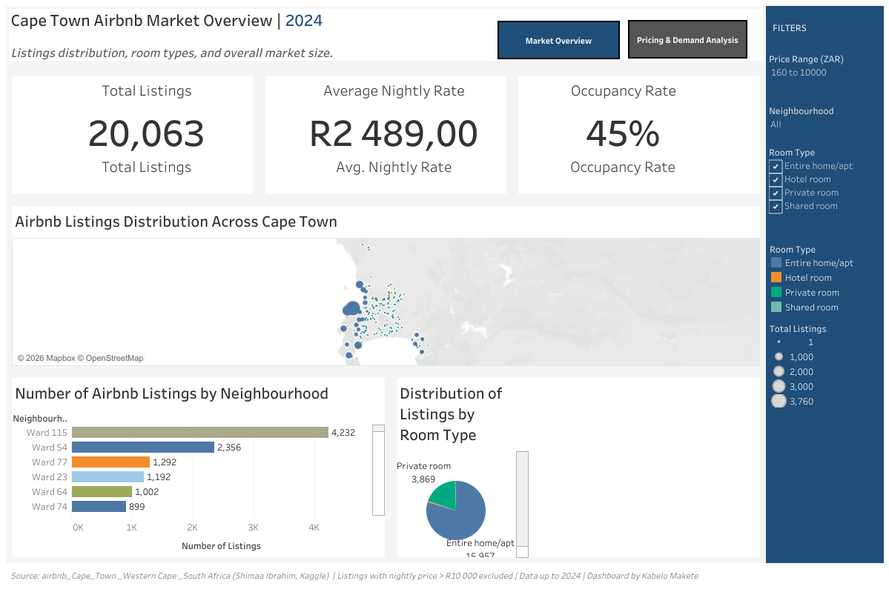
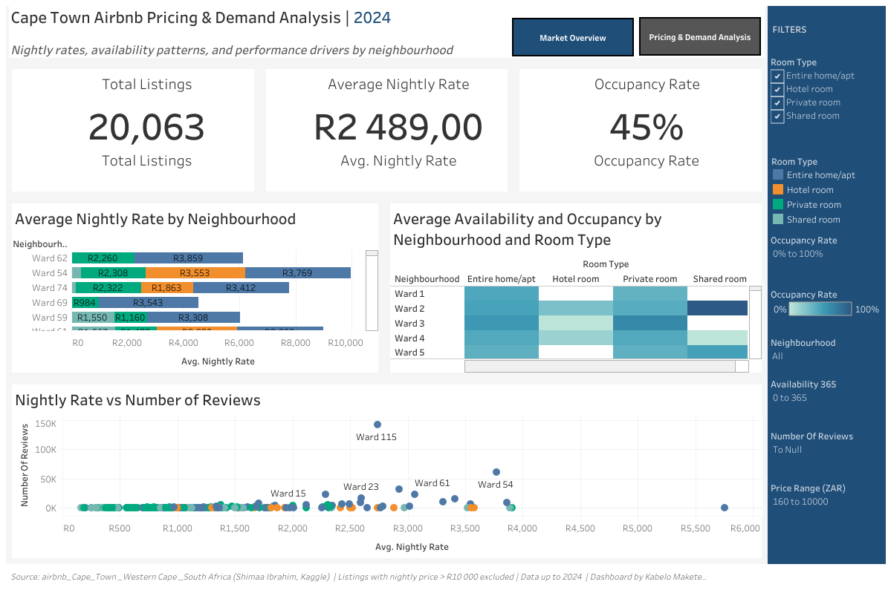

# Cape-Town-Airbnb-Market-Analysis 
Exploratory market analysis and visualization of Cape Town Airbnb listings using Tableau Public.

Prices above R10 000 per night were treated as outliers and excluded from average calculations.

Data up to year 2024. Last updated 2024.

# Cape Town Airbnb Market Analysis 

## Project Overview
This project analyses the Cape Town Airbnb market to uncover pricing trends,
neighbourhood performance, listing availability, and demand patterns using
interactive Tableau dashboards.

The goal is to demonstrate data analysis, visualization, and business insight
skills relevant to roles in analytics, finance, banking, and consulting.

---

## Live Dashboards (Tableau Public)
 **View the interactive dashboards here:**  
https://public.tableau.com/app/profile/kabelo.makete/viz/CapeTownAirbnbMarketDataProject/CapeTownAirbnbMarketOverview

---

## Key Questions Answered
- Which neighbourhoods generate the highest Airbnb revenue?
- How does pricing vary by room type?
- What is the relationship between availability and price?
- What is the relationship between price and reviews?
- Which areas show strong investment potential?

---

## Tools & Technologies
- Tableau Public
- Microsoft Excel / CSV
- GitHub (documentation & version control)

---

## Dashboard Preview

**CAPE TOWN AIRBNB MARKET OVERVIEW DASHBOARD**

---

**CAPE TOWN AIRBNB PRICING & DEMAND ANALYSIS DASHBOARD**

---

## Insights & Findings
- Central and costal neighborhood areas command premium pricing
- Entire homes outperform private rooms in revenue
- High availability does not always imply high profitability
- Mid-Higher priced listings tend to attract more reviews indicating higher occupancy levels

---
## Data Source

**Dataset name:** airbnb_Cape_Town_Western Cape_South Africa

**Source:** Kaggle | Shimaa Ibrahim

**URL:** https://www.kaggle.com/datasets/shimaaraouf/airbnb-cape-town-western-cape-south-africa/data

**License:** Unknown

**Date downloaded:** 2025-12-23

---

## Contact
**Kabelo Makete**  
BCom Financial Management | Aspiring Financial & Data Analyst  
**LinkedIn:** https://www.linkedin.com/in/kabelo-makete-68994b205/

